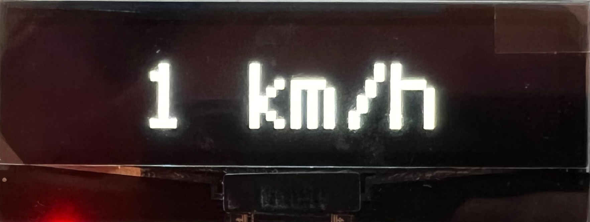
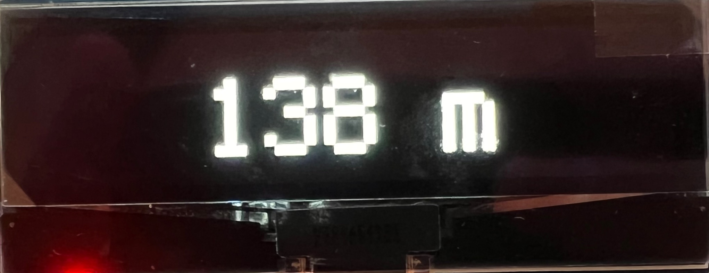
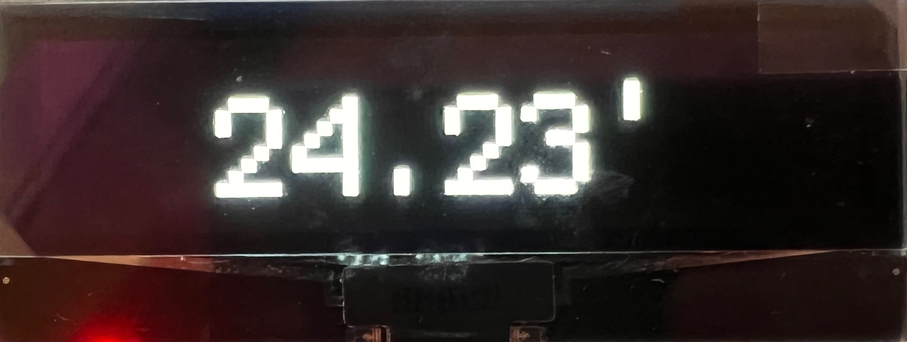
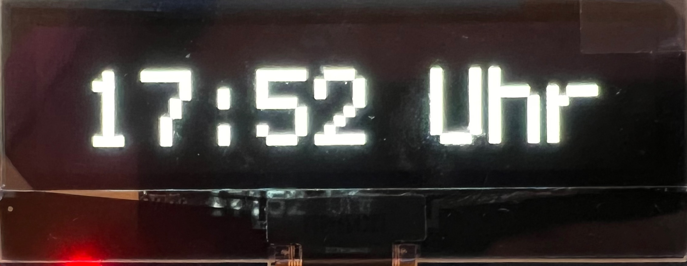
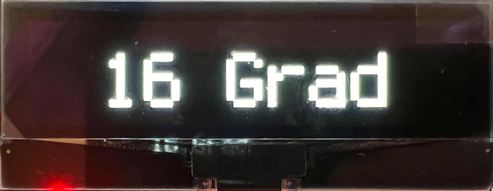
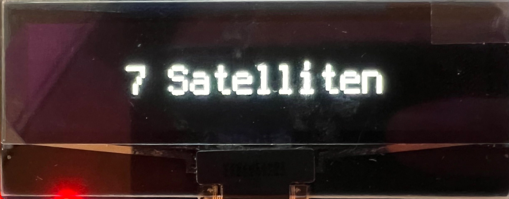

# circuit-python-bcm
A simple body computer unit written in circuit-python made for RP2040 boards.

This project is designed to work in line with the [Waveshare Pico OLED 2.23](https://www.waveshare.com/wiki/Pico-OLED-2.23) and the [Waveshare L76B GNSS Module for Raspberry Pi Pico](https://www.waveshare.com/wiki/Pico-GPS-L76B) but can easily be adapted to work with any SPI / I2C Display and NMEA based GPS devices.

To switch between the different modes, a button is used. For the Raspberry Pi Pico used in this code example, pin GP16 is used.
## Modes
The following modes are currently implemented:
### Speed
The current speed in Kilometers per hour.

### Distance
The driven distance since the last device restart. Can be reset by a long press while the distance screen is active.

### Heading
The current heading in degrees.

### Time
The current time. Use the field UTC_OFFSET to adjust your difference to UTC.

### Temperature
The current temperature in degrees celsius on the chip off the RP2040. Depending on where your device is placed, this might vary from the "real" temperature.

### Number of satellites
The current number of satellites the GPS device has in sight.
